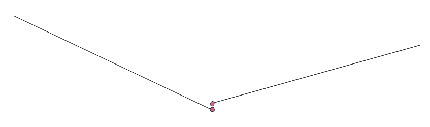
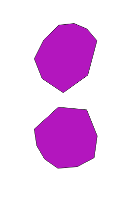
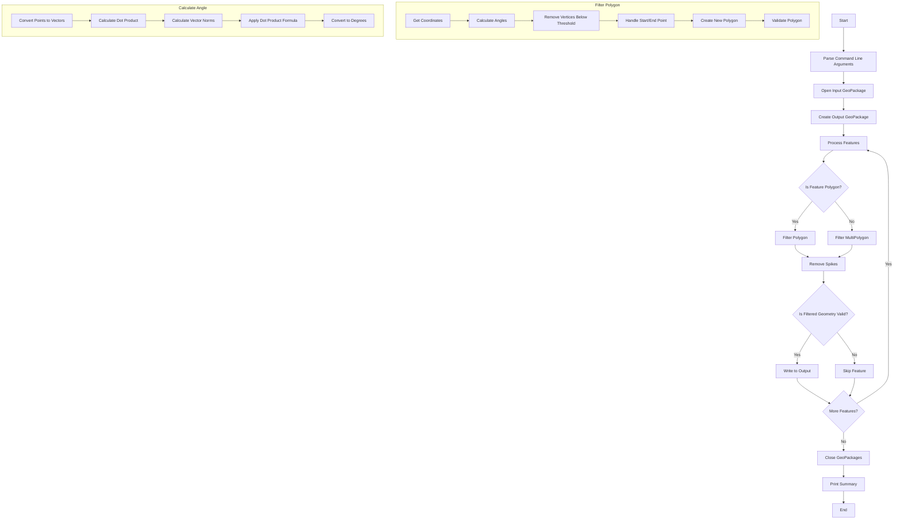

# Unspike gpkg (Python stand-alone version)

**unspike** is a tool designed to remove 'spikes' from polygons in GeoPackage files by filtering out vertices that form angles sharper than a specified threshold. It works with both 2D and 3D geometries and supports both single Polygons and MultiPolygons.

### Before and After




## Features

- Removes spike vertices from Polygons and MultiPolygons
- Supports both 2D and 3D geometries
- Preserves the original coordinate reference system (CRS)
- Handles invalid geometries by attempting to make them valid
- Provides verbose output option for detailed processing information
- Automatically generates output filename if not specified

## Requirements

- Python 3.6+
- Dependencies:
  - fiona
  - numpy
  - shapely
  - pyproj

You can install the required dependencies using pip:

```
pip install fiona numpy shapely pyproj
```

## Usage

To use the tool, run the script from the command line with the following arguments:

```
python unspike.py -i <input_file> [-o <output_file>] -a <minimum_angle> [-v]
```

Arguments:
- `-i`, `--input`: Path to the input GeoPackage file (required)
- `-o`, `--output`: Path to the output GeoPackage file (optional, will be auto-generated if not provided)
- `-a`, `--angle`: Minimum angle threshold in degrees (required)
- `-v`, `--verbose`: Enable verbose output (optional)

Example:
```
python unspike.py -i input.gpkg -o output.gpkg -a 4.5 -v
```

This command will process `input.gpkg`, remove spikes with angles less than 4.5 degrees, and save the result to `output.gpkg` with verbose output.

## How It Works

1. The script reads the input GeoPackage file using Fiona.
2. For each feature in the file:
   - It converts the geometry to a Shapely object.
   - It processes the geometry using the `filter_vertices` function, which removes vertices that form angles smaller than the specified threshold.
   - If the resulting geometry is valid and not empty, it's written to the output file.
3. The script maintains the original CRS and attempts to preserve the validity of the geometries.
4. If a polygon becomes invalid after processing, the script attempts to make it valid using Shapely's `make_valid` function.

## Output

The script generates a new GeoPackage file with the processed geometries. It also prints a summary of the processing, including:
- Number of features processed
- Number of features skipped (if any became empty or invalid)
- Total number of spikes removed

## Notes

- The script suppresses deprecation warnings from Fiona and PyProj to reduce clutter in the output.
- Geometries that become empty or invalid after processing are skipped and not included in the output file.
- The script uses numpy for efficient angle calculations.
- Portions of the code and documentation was generated by LLM AI under guidance of the author

## Flow Diagram

